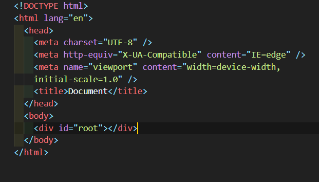

## 테스트의 필요성.

최종적으로 코드 테스트를 할 때 console.log()로만 하는 것은 오류의 소지가 있다. 프로그래밍이란 기본적으로 사람을 안믿기 때문에 기계에게 요청

## Jest

Jest 설치
https://poiemaweb.notion.site/Set-up-3801e53e5dae4c13ac750dfe33f1c6f1

Jest 사용
알고리즘 풀이 묶음 한번에 테스트

---

## DOM

naver.com 을 주소창에 치면 어떤 일이 일어나나.

DNS - 문자열로 이루어져있는 url과 ip address를 교환해줌.

http
기본적으로 port에 들어가게 됨.

http(s)://vbghdl@naver.com[:8080]/abc/

8080 - 포트 포트가 끼어들어올 수 있음.
안보이는 곳? 포트는 원래 있는데 서버설정으로 감춰저있는 경우

포트는 항구. 각 서버로 연결된 통로.
서버 한개에 웹서버, 데이터서버 두개가 있다치면 우리가 보낸 요청이 웹서버에 전달되도록 하는거~

/ = path
경로

웹서버 프로그래밍은 자기의 루트가 어디인지 지정해주면, 거기에 웹문서 저장.

http(s)://vbghdl@naver.com[:8080] 요거 까지는 그냥 서버 찾아가는 용도 abc/ 여기가 루트기준 abc 찾아가는거

https://www.naver.com
뒤에 /가 감춰저 있음 -> **루트요청**

루트에 있는 index.html을 찾아서 주라는 요청!

그러면 요청받은 서버가 랜선을 통해 그걸 보내주는데.

랜선엔 전기만 전달가능 -> 숫자 -> 결국 이진수인 숫자 (http 프로토콜 규약에 의해)
ascci 코드의 숫자를 기초로 전기로 바꿔서

패킷당으로 브라우저가 모아서 받는다. 그리고 그걸 문자열화
ascci 코드로 갔는데 한글은? 한글은 보낼 때 인코딩을 통해 바꿔서 서버가 보내는데 뭘로 인코딩을 할지에 대한 정보가 html meta 태그에 명시되어 있어야함.

~~

## DOM에 API

getElementById() id 있는놈은 얘
없는 놈은 querrySellector()

getElements~~ 여러개 가지고오는 용도=> 이 계열은 안씁니다.
이유는 라이브 객체를 리턴하기 때문에
여러개의 대체제로 querrySellectorAll()
근데 얘가 노드 리스트로 갖고 오기 때문에 무조건 배열로 컨버팅해서 씁니다.

- 탐색

주의해야할거. 탐색할 때 text노드가 걸릴때가 있는데 필요가 없어
걸러야됨 -> 걸르려면 element가 들어있는걸 써야된다.

nextSibbling 대신 nextEl~Sibbling

childNodes() 대신 children()

children도 배열로 바꿔서 써야한다.

- 클래스 조작

className() 문자열 반환.

대부분 classList를 쓰면 된다.
add, remove, toggle, contains 요거를 잘쓰면 된다.

- html 조작

노드 객체에다가 ~

**SPA**
왜 쓰나 애플리케이션 만들 때 구조를 보니 페이지가 여러개 있단 말이지, 근데 대체적으로 페이지의 구조가 비슷비슷 하더라. 그런데 클릭할 때마다 전부 가져와야 하나(html을 새로 다 갈아낌)? 레이아웃이 비슷하니 바뀌는 부분만 가져오면 더 좋지 않을까?

최소한의 데이터만을 교환하기 위한 방법으로 등장.
바뀌는 부분의 데이터만 받는다. html을 받는게 아니라 데이터만!

어떤 방식으로 주는가? 다 json이라는 방식으로 준다. 예전엔 xml을 썼는데. (근데 이제 안쓰는게 배보다 배꼽이 더큼. <foo>~~~</foo> 요런식으로 와서. 사실 ~~~~만 필요한건데 필요없는 메타데이터가 따라오기 때문에.) json 은 필요한거만 객체형태로 와서 리소스 적고 객체 형태니 개발 친화적.

## SPA json 이용해서 필요한 데이터를 동적 생성해서 갈아낌.

현업에서 DOM api 를 쓸 일이 얼마나 있을까? 없다.
괜히 배웠나? 그게 아니라 회사에 가서는 생산성 위해서 그런거 안하고 react나 angular 쓰는데. 그거를 쓰기 위해서는 dom이 어떤 방식으로 돌아가는지 알아야함.

또 취업 위해서. 심지어 과제도 바닐라로 하라그래. 기본기를 시험하기 위해서. 그래서 깊이있는 기본기 학습이 필요함.
